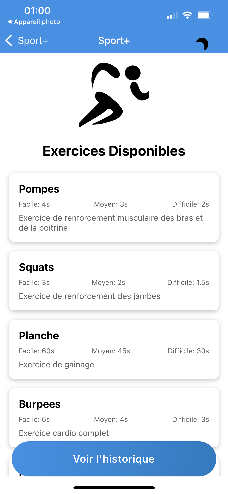

# Sport Plus 🏋️‍♂️

Sport Plus est une application mobile développée avec Expo qui vous permet de suivre vos séances d'entraînement sportif. L'application offre un suivi complet de vos exercices, qu'ils soient terminés ou abandonnés, avec la possibilité d'ajuster la difficulté selon vos besoins.

## Fonctionnalités

- 📱 Interface intuitive et moderne
- 📊 Historique détaillé des exercices
- ⚙️ Ajustement de la difficulté des exercices
- 📝 Suivi des exercices terminés et abandonnés
- 🎯 Progression personnalisée

## Prérequis

- Node.js (version 14 ou supérieure)
- npm ou yarn
- Expo CLI (`npm install -g expo-cli`)
- Un iPhone avec l'application Expo Go installée

## Installation

1. Clonez le repository :
```bash
git clone [URL_DU_REPO]
cd sport-plus
```

2. Installez les dépendances :
```bash
npm install
# ou
yarn install
```

3. Lancez l'application :
```bash
npm start
# ou
yarn start
```

4. Scannez le QR code avec l'application Expo Go sur votre iPhone

## Utilisation

Une fois l'application lancée :
1. Choisissez votre programme d'exercices
2. Ajustez la difficulté selon votre niveau
3. Suivez les instructions pour chaque exercice
4. Consultez votre historique pour suivre votre progression

## Technologies utilisées

- Expo
- React Native
- TypeScript
- Expo Router


